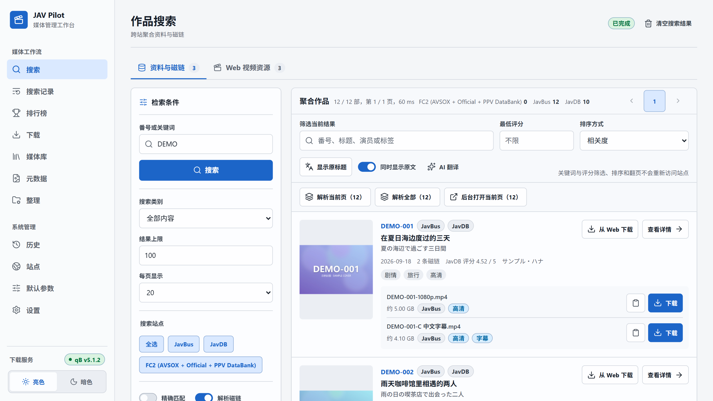
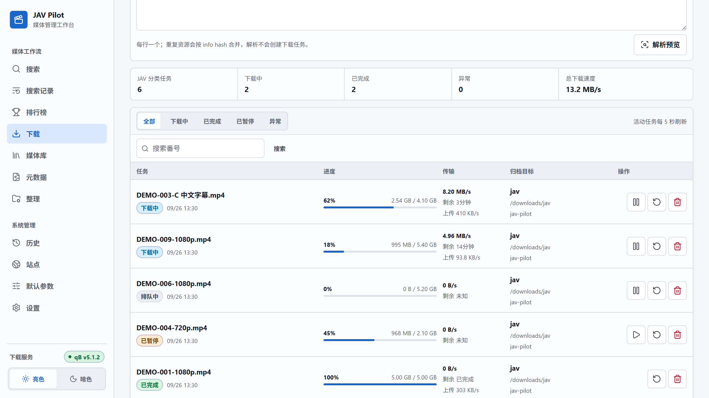
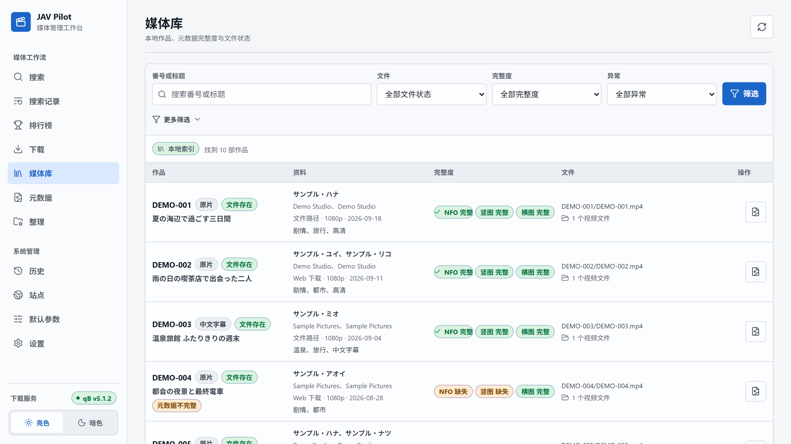
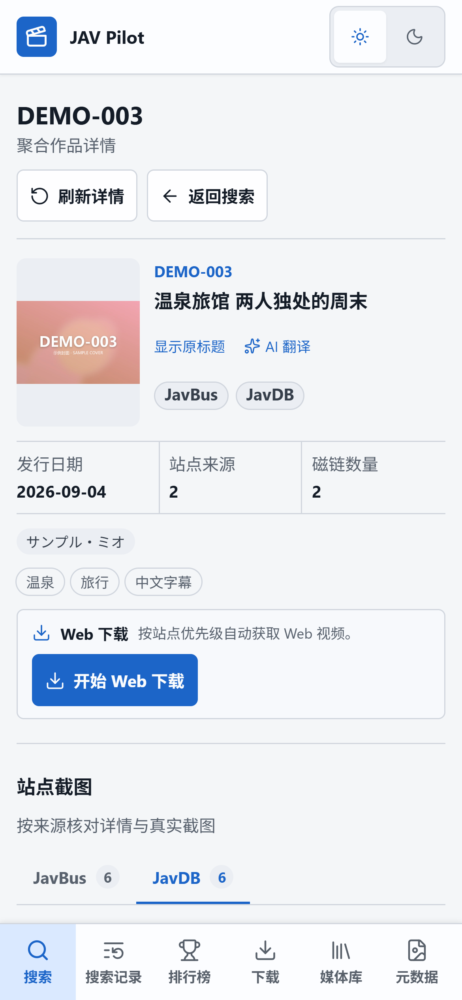

# JAV Pilot

[](https://hub.docker.com/r/drdon1234/jav-pilot)
[](LICENSE)

JAV Pilot 是一个部署在自己 NAS 或电脑上的网页应用，把**找片、下载、整理**三件事放在一个地方完成：

1. **找片**：输入番号或关键词，同时查询 JavBus、JavDB、FC2 等多个资料站，在一页里看到封面、演员、标签、评分和所有可用的磁链。
2. **下载**：挑一个磁链交给 qBittorrent，或者直接从 JableTV、SupJav、MissAV 下载视频。已经下载过的作品会先提醒你。
3. **整理**：下载完成后自动放进媒体库，配好海报、背景图和影片信息，Jellyfin、Emby、Kodi 打开就能直接浏览。

适合已经在用 NAS、qBittorrent 和 Jellyfin / Emby / Kodi 管理影片的人。所有设置、记录和影片都只保存在你自己的机器上，电脑和手机都能使用。



<sub>截图均使用虚构的示例数据。</sub>

## 功能

- **一次搜多个站**：同一部作品只显示一条结果，资料来自哪个站点一目了然；磁链列出大小、来源和是否带字幕。
- **两种下载方式**：磁链下载交给 qBittorrent；视频站下载会自动挑选画质，并按原片、中文字幕、无码的顺序选择版本。
- **自动整理**：下载好的影片按番号归档，生成海报、背景图和 NFO 影片信息。
- **媒体库**：扫描你的影片目录（包括手动放进去的），缺少海报或信息的作品可以一键补全。
- **其他**：JavDB 排行榜、标题翻译（也可以接入你自己的 AI 服务）、站点可用性检查、下载完成通知、暗色主题。

## 安装

需要一台装有 Docker 的 Linux 主机或 NAS（x86_64 / amd64）。Windows 用户可以在 WSL2 中安装。

根据你的情况选择一种方式：

| 方式 | 适合 |
| --- | --- |
| [一：只部署 JAV Pilot](#方式一只部署-jav-pilot) | 已经有 qBittorrent，或只用视频站下载 |
| [二：JAV Pilot 和 qBittorrent 一起部署](#方式二jav-pilot-和-qbittorrent-一起部署) | 还没有 qBittorrent |
| [三：从源码构建](#方式三从源码构建) | 想修改代码或自己构建镜像 |

### 方式一：只部署 JAV Pilot

**1. 下载配置文件**

```bash
mkdir jav-pilot && cd jav-pilot
curl -fsSL -o docker-compose.yml https://raw.githubusercontent.com/drdon1234/JAV-Pilot/main/deploy/docker-compose.yml
curl -fsSL -o .env https://raw.githubusercontent.com/drdon1234/JAV-Pilot/main/deploy/.env.example
```

**2. 填写配置**

下面这条命令生成登录用的随机密钥，并让 JAV Pilot 以你当前的账号读写文件：

```bash
sed -i "s/^JAV_PILOT_AUTH_SECRET=.*/JAV_PILOT_AUTH_SECRET=$(openssl rand -hex 32)/; s/^PUID=.*/PUID=$(id -u)/; s/^PGID=.*/PGID=$(id -g)/" .env
```

然后用编辑器打开 `.env`，设置登录密码 `JAV_PILOT_AUTH_PASSWORD`（至少 12 个字符）。影片默认放在当前目录下的 `media/`；想放到 NAS 的其他目录时，一并修改 `.env` 中的目录设置。

**3. 启动**

```bash
docker compose up -d
```

第一次启动需要下载约 1.1 GB 的镜像。完成后在浏览器打开 `http://<这台机器的 IP>:8766`，用户名 `admin`，密码是你刚设置的密码。

### 方式二：JAV Pilot 和 qBittorrent 一起部署

步骤与方式一相同，只是第 1 步下载的配置文件不同：

```bash
mkdir jav-pilot && cd jav-pilot
curl -fsSL -o docker-compose.yml https://raw.githubusercontent.com/drdon1234/JAV-Pilot/main/deploy/docker-compose.qbittorrent.yml
curl -fsSL -o .env https://raw.githubusercontent.com/drdon1234/JAV-Pilot/main/deploy/.env.example
```

完成方式一的第 2、3 步后，再把两者连接起来：

1. 查看 qBittorrent 的初始密码：`docker compose logs qbittorrent | grep -i password`。
2. 打开 `http://<这台机器的 IP>:8080`，用户名 `admin`，用初始密码登录后，在“工具 → 选项 → WebUI”中设置自己的密码。
3. 在 JAV Pilot 的“设置 → qBittorrent”中填写地址 `http://qbittorrent:8080`、用户名 `admin` 和你设置的密码。

两者已经共用下载和影片目录，不需要再设置路径。请按顺序操作：qBittorrent 的初始密码每次重启都会变，在改密码之前就填写地址，JAV Pilot 会因为多次登录失败被 qBittorrent 暂时拒绝。

### 方式三：从源码构建

需要额外安装 Git 和 Python 3。

```bash
git clone https://github.com/drdon1234/JAV-Pilot.git
cd JAV-Pilot
python3 tools/prepare_compose.py
docker compose build
python3 tools/prepare_compose.py --browser-volume
docker compose up -d --no-build
```

脚本会生成包含随机登录密码的 `.env`，账号和密码都在里面。第一次构建需要较长时间。这种方式默认只能在本机访问，局域网访问等设置见[安装指南](docs/getting-started.md#从源码构建)。

### 更新

方式一、二在配置文件所在目录执行：

```bash
docker compose pull
docker compose up -d
```

方式三执行 `git pull`，再重新运行上面的 `docker compose build` 和 `docker compose up -d --no-build`。

## 开始使用

1. **检查站点**：打开“站点 → 站点诊断”，填一个你确定存在的番号，点击“测试全部站点”，确认哪些站点能正常访问。连不上时通常需要设置代理，见[常见问题](docs/faq.md#所有站点都连不上)。
2. **连接 qBittorrent**（可选）：在“设置 → qBittorrent”中填写地址和账号。qBittorrent 和 JAV Pilot 看到的目录路径不同时，需要按[使用指南](docs/usage.md#2-连接-qbittorrent可选)对应好。
3. **搜索并下载**：在“搜索”中输入番号，打开作品详情，选择磁链“下载”或“开始 Web 下载”，在“下载”页查看进度。

更详细的说明见[使用指南](docs/usage.md)。

## 界面

| 下载任务 | 媒体库 | 手机 |
| --- | --- | --- |
|  |  |  |

## 文档

- [安装指南](docs/getting-started.md)：目录设置、远程访问、不使用 Docker 运行
- [使用指南](docs/usage.md) · [常见问题](docs/faq.md) · [配置](docs/configuration.md) · [备份与运维](docs/operations.md)
- [来源说明](docs/sources.md)：各站点能提供什么 · [种子索引](docs/indexers.md)：接入 Sukebei、Tokyo Toshokan
- 开发者：[架构](docs/architecture.md) · [HTTP API](docs/api.md) · [开发与验证](docs/development.md) · [安全说明](SECURITY.md)

## 数据与隐私

设置、记录和数据库保存在部署目录的 `data/`，登录密码保存在 `.env`，请不要分享这两者。JAV Pilot 只访问你启用的站点；此外只有这些内容会发往外部：开启标题翻译时的标题文字（免费的公共翻译服务，可以关闭）、点击“AI 翻译”时发给你配置的 AI 服务的标题，以及你设置的通知。

## 免责声明

JAV Pilot 只是工具，不提供任何影片、账号或资源，也不保证能搜到或下载到特定内容。请只下载你有权获取的内容，并遵守当地法律和各站点的使用条款。

## 许可证

代码采用 [MIT License](LICENSE)。许可证不授予第三方影片、图片、站点资料或商标的使用权。
