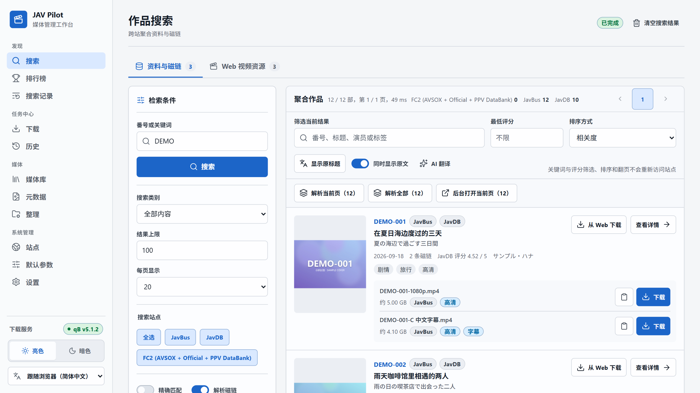
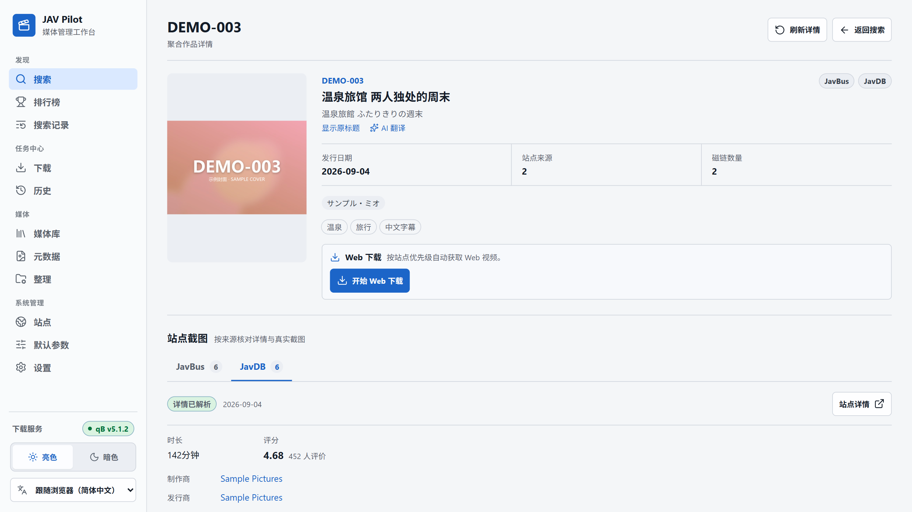
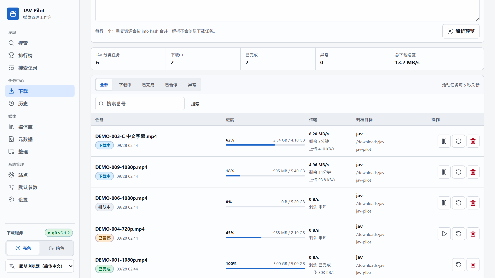
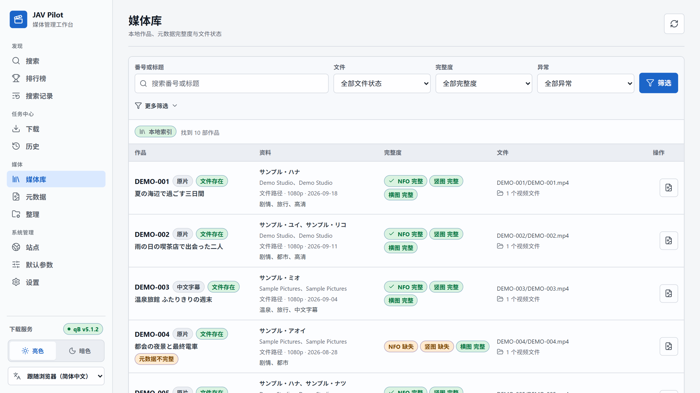
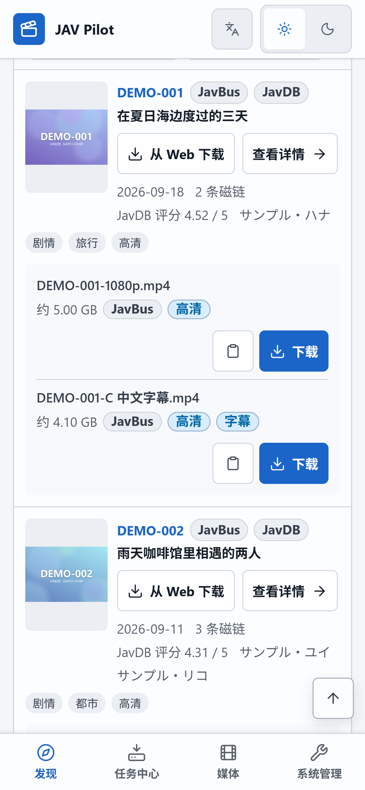
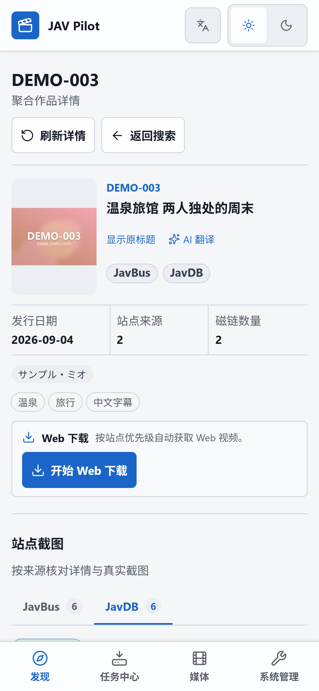

<p align="center">
  
</p>

<div align="center">

<a href="../../README.md">简体中文</a> |
<a href="README_zh-TW.md">繁體中文</a> |
<a href="README_en.md">English</a> |
<a href="README_ja.md">日本語</a> |
<b>Français</b> |
<a href="README_es.md">Español</a> |
<a href="README_ru.md">Русский</a> |
<a href="README_ar.md">العربية</a>

<a href="https://hub.docker.com/r/drdon1234/jav-pilot"></a>
<a href="https://hub.docker.com/r/drdon1234/jav-pilot"></a>


<a href="../../LICENSE"></a>
<br>

<a href="../guide/getting-started.md">Installation</a> |
<a href="../guide/usage.md">Utilisation</a> |
<a href="../guide/faq.md">FAQ</a> |
<a href="../guide/configuration.md">Configuration</a> |
<a href="https://github.com/drdon1234/JAV-Pilot/issues">Signaler un problème</a>

</div>

<br>

JAV Pilot est une application auto-hébergée de recherche, de téléchargement et de gestion de médiathèque vidéo. Elle s’exécute sur un NAS, un serveur Linux ou un ordinateur personnel. Elle agrège les résultats de plusieurs sites de métadonnées, télécharge via qBittorrent ou directement depuis des sites vidéo, puis classe chaque téléchargement terminé dans la médiathèque avec affiches et métadonnées NFO reconnues directement par Jellyfin, Emby et Kodi. Tous les paramètres, historiques et fichiers restent sur votre propre machine, et l’interface web fonctionne sur les navigateurs de bureau et mobiles.

> [!NOTE]
> La documentation détaillée du dossier `docs/` n’est actuellement disponible qu’en chinois simplifié. L’interface web est disponible en français et suit par défaut la langue du navigateur et du système.

<p align="center">
  
  <br>
  <sub>Toutes les captures d’écran utilisent des données d’exemple fictives.</sub>
</p>

## ✨ Fonctionnalités

1. 🔍 **Recherche multisite** : interroge en parallèle JavBus, JavDB, FC2 et d’autres sites de métadonnées, fusionne les résultats d’une même œuvre par code catalogue (番号) et conserve la source de chaque champ.
2. 🧲 **Agrégation des liens magnet** : affiche la taille, la source et les sous-titres, avec dédoublonnage par info hash ; Sukebei et Tokyo Toshokan peuvent être ajoutés via Jackett.
3. ⬇️ **Deux canaux de téléchargement** : les liens magnet sont transmis à qBittorrent ; les téléchargements web choisissent automatiquement la qualité et privilégient, dans cet ordre, la version originale, sous-titrée en chinois puis non censurée.
4. 🔁 **Détection des doublons** : avant de créer une tâche, les tâches qBittorrent, les téléchargements web et la médiathèque sont vérifiés afin d’éviter les téléchargements en double.
5. 🗂️ **Classement automatique** : les téléchargements terminés sont classés par code catalogue, avec génération des affiches, des images de fond et des métadonnées NFO.
6. 📚 **Gestion de la médiathèque** : analyse le dossier des vidéos, y compris les fichiers ajoutés manuellement, et complète les affiches et métadonnées manquantes.
7. 🏆 **Classements** : classements des œuvres, des actrices et des catégories issus de JavDB, FANZA, FC2, MGStage et d’autres sources, avec analyse groupée des fiches en arrière-plan.
8. 🌐 **Traduction des titres** : service de traduction public intégré, avec prise en charge de services d’IA tels que les API compatibles OpenAI, Claude, Gemini et Ollama ; les traductions utilisent par défaut la langue de l’interface.
9. 🩺 **Diagnostic des sites** : vérifie périodiquement la disponibilité des sites et distingue les échecs DNS, de connexion, TLS, de vérification anti-robot et de changement de structure des pages.
10. 🔔 **Notifications** : envoie des notifications via Webhook, Gotify, Telegram ou le système de notification du NAS lorsqu’un téléchargement se termine ou échoue, que l’espace disque est insuffisant ou qu’un site est défaillant.
11. 📱 **Interface multilingue et adaptative** : disponible en 简体中文, 繁體中文, English, 日本語, Français, Español, Русский et العربية, en suivant par défaut la langue du navigateur et du système ; fonctionne sur ordinateur et sur mobile, avec thèmes clair et sombre.

## 🚀 Démarrage rapide

Trois méthodes d’installation sont proposées. La méthode 1 est recommandée pour un premier déploiement.

| Méthode | Cas d’usage | Prérequis |
| --- | --- | --- |
| [Méthode 1 : Docker (recommandé)](#méthode-1--déploiement-docker-recommandé) | NAS, serveur Linux ou WSL2 sous Windows | Docker et Docker Compose v2 |
| [Méthode 2 : compilation depuis les sources](#méthode-2--construire-limage-depuis-les-sources) | Modifier le code source ou construire sa propre image | Docker, Git |
| [Méthode 3 : sans Docker](#méthode-3--sans-docker) | Aucun Docker disponible, ou exécution en tant que service système | Git, Python 3.11+, Node.js 24 |

### Méthode 1 : déploiement Docker (recommandé)

Utilise l’image publiée sur Docker Hub. Seuls un fichier `docker-compose.yml` et un fichier `.env` sont nécessaires.

> [!NOTE]
> L’image ne prend en charge que l’architecture x86_64 (amd64). Sous Windows, exécutez les étapes suivantes dans WSL2.

**1. Choisir un fichier Compose**

Chaque fichier Compose déploie les services suivants :

| Fichier Compose | Services déployés |
| --- | --- |
| `docker-compose.yml` | JAV Pilot |
| `deploy/docker-compose.jackett.yml` | JAV Pilot, Jackett |
| `deploy/docker-compose.qbittorrent.yml` | JAV Pilot, qBittorrent |
| `deploy/docker-compose.full.yml` | JAV Pilot, qBittorrent, Jackett |

qBittorrent est un client BitTorrent ; Jackett fournit l’interface Torznab pour Sukebei et Tokyo Toshokan. Les conteneurs déployés avec JAV Pilot s’appellent `jav-pilot-qbittorrent` et `jav-pilot-jackett` ; ils n’entrent pas en conflit avec des conteneurs existants du même type.

**2. Télécharger le fichier Compose et le modèle de configuration**

```bash
mkdir jav-pilot && cd jav-pilot
curl -fsSL -o docker-compose.yml https://raw.githubusercontent.com/drdon1234/JAV-Pilot/main/docker-compose.yml
curl -fsSL -o .env https://raw.githubusercontent.com/drdon1234/JAV-Pilot/main/.env.example
```

Si vous avez choisi un fichier du dossier `deploy/` à l’étape 1, remplacez `main/docker-compose.yml` dans la deuxième commande par son chemin (par exemple `main/deploy/docker-compose.full.yml`). Le fichier enregistré garde le nom `docker-compose.yml`.

**3. Renseigner `.env`**

Exécutez la commande suivante pour générer la clé de session et définir l’identité d’exécution (`PUID` / `PGID`) sur le compte actuel :

```bash
sed -i "s/^JAV_PILOT_AUTH_SECRET=.*/JAV_PILOT_AUTH_SECRET=$(openssl rand -hex 32)/; s/^PUID=.*/PUID=$(id -u)/; s/^PGID=.*/PGID=$(id -g)/" .env
```

Modifiez ensuite `.env` (par exemple avec `nano .env`) :

- `JAV_PILOT_AUTH_PASSWORD` : mot de passe de connexion, 12 caractères minimum. Obligatoire.
- `QBITTORRENT_PASSWORD` : à renseigner si qBittorrent est déployé avec JAV Pilot, 6 caractères minimum. Il devient le mot de passe de l’interface web de qBittorrent (utilisateur `admin`), et JAV Pilot s’y connecte automatiquement avec les mêmes identifiants.
- Dossiers : la médiathèque se trouve par défaut dans `media/` du dossier courant. Pour utiliser un autre dossier du NAS, modifiez la section « 目录 » (Dossiers) de `.env`.

**4. Démarrer le service**

```bash
docker compose up -d
```

Le premier démarrage télécharge une image d’environ 1,1 Go. Ouvrez ensuite `http://<IP de l’hôte>:8766` dans un navigateur et connectez-vous avec l’utilisateur `admin` et le mot de passe défini à l’étape précédente.

Si un paramètre obligatoire manque, `docker compose` l’indique explicitement. Pour les autres problèmes, consultez le [guide d’installation](../guide/getting-started.md#启动失败时). Pour qBittorrent et Jackett, consultez le [guide d’installation](../guide/getting-started.md#同时部署-qbittorrent-或-jackett) et les [indexeurs de torrents](../guide/indexers.md).

### Méthode 2 : construire l’image depuis les sources

Construit l’image localement, pour les cas où le code source doit être modifié. Hormis l’image, les étapes sont identiques à la méthode 1.

```bash
git clone https://github.com/drdon1234/JAV-Pilot.git
cd JAV-Pilot
docker build -t jav-pilot:local .
cp .env.example .env
```

Renseignez `.env` comme à l’étape 3 de la méthode 1, définissez `JAV_PILOT_IMAGE` sur `jav-pilot:local`, puis exécutez `docker compose up -d`. La première construction télécharge le navigateur et les dépendances et compile FFmpeg, ce qui prend du temps.

Cette méthode déploie uniquement JAV Pilot. Pour déployer également qBittorrent ou Jackett, consultez le [guide d’installation](../guide/getting-started.md#方式二从源码构建镜像).

### Méthode 3 : sans Docker

JAV Pilot est lui-même un service web et s’exécute directement sous Linux, macOS ou Windows. Prérequis : Git, Python 3.11 ou ultérieur (3.12 recommandé), Node.js 24 et npm ; Debian / Ubuntu nécessitent en outre `python3-venv`. Sous Linux / macOS :

```bash
git clone https://github.com/drdon1234/JAV-Pilot.git
cd JAV-Pilot
python3 -m venv .venv
. .venv/bin/activate
python -m pip install -e .
python -m playwright install chromium
npm --prefix frontend ci
npm --prefix frontend run build
jav-pilot serve
```

Ouvrez ensuite `http://127.0.0.1:8766`. Par défaut, le service n’écoute que sur la machine locale et ne demande pas de connexion. Pour les commandes sous Windows, consultez les [étapes d’installation](../guide/getting-started.md#安装步骤) ; pour l’accès depuis le réseau local (connexion obligatoire), l’exécution en service systemd, le dossier de la médiathèque et les téléchargements web, consultez le [guide d’installation](../guide/getting-started.md#方式三不使用-docker).

### Mise à jour

**Méthode 1** : à exécuter dans le dossier contenant le fichier Compose

```bash
docker compose pull
docker compose up -d
```

**Méthode 2** : à exécuter dans le dossier du dépôt

```bash
git pull
docker build -t jav-pilot:local .
docker compose up -d
```

**Méthode 3** : à exécuter dans le dossier du dépôt, puis redémarrer le service

```bash
git pull
python -m pip install -e .
npm --prefix frontend ci
npm --prefix frontend run build
```

## 🧭 Configuration initiale

1. **Vérifier la disponibilité des sites** : dans « Sites → Diagnostic des sites », saisissez un code catalogue existant et cliquez sur « Tester tous les sites ». Si aucun site n’est accessible, un proxy est généralement nécessaire ; consultez la [FAQ](../guide/faq.md#所有站点都连不上).
2. **Connecter un qBittorrent existant** (facultatif) : un qBittorrent déployé avec JAV Pilot est déjà connecté ; cette étape peut être ignorée. Pour un qBittorrent existant, saisissez son adresse et son compte dans « Réglages → qBittorrent ». Si qBittorrent et JAV Pilot ne voient pas les mêmes chemins de dossiers, configurez la correspondance des chemins comme indiqué dans le [guide d’utilisation](../guide/usage.md#2-连接-qbittorrent可选).
3. **Rechercher et télécharger** : saisissez un code catalogue dans « Recherche », ouvrez la fiche de l’œuvre, choisissez « Télécharger » sur un lien magnet ou « Lancer le téléchargement Web », puis suivez la progression sur la page « Téléchargements ».

Consultez le [guide d’utilisation](../guide/usage.md) pour la procédure complète.

## 🌐 Sources et intégrations prises en charge

| Catégorie | Prise en charge |
| --- | --- |
| Métadonnées et liens magnet | JavBus, JavDB, FC2 (activés par défaut) ; FANZA, MGS, AVBase, FC2DB, JAVTEN (activables dans « Sites ») |
| Indexeurs de torrents | Sukebei, Tokyo Toshokan (via Jackett, déployable avec JAV Pilot) |
| Téléchargements vidéo | JableTV, SupJav, MissAV |
| Classements | JavDB, FANZA, FC2, MGStage, JavMenu, ainsi que les sites officiels de studios non censurés tels que 1Pondo et Caribbeancom |
| Client de téléchargement | qBittorrent |
| Serveurs multimédias | Jellyfin, Emby, Kodi (lecture des NFO, affiches et images de fond) |
| Traduction par IA | OpenAI et API compatibles, Anthropic Claude, Google Gemini, Azure OpenAI, Ollama, etc. |
| Notifications | Webhook, Gotify, Telegram, notifications du NAS |

Les sites externes peuvent modifier leur structure, restreindre l’accès selon la région ou exiger une vérification anti-robot. Pour les données fournies par chaque site et sa disponibilité actuelle, consultez la [description des sources](../guide/sources.md) et « Sites → Diagnostic des sites » dans l’application.

## 📸 Captures d’écran

<p align="center">
  
  
</p>
<p align="center">
  
  
  
  <br>
  <sub>Fiche d’une œuvre · Tâches de téléchargement · Médiathèque · Mobile</sub>
</p>

## 📖 Documentation

La documentation est rédigée en chinois simplifié.

| Utilisation | Développement |
| --- | --- |
| [Guide d’installation](../guide/getting-started.md) : méthodes d’installation, dossiers et accès distant | [Architecture](../guide/architecture.md) |
| [Guide d’utilisation](../guide/usage.md) : de la vérification des sites au téléchargement et au classement | [API HTTP](../guide/api.md) |
| [FAQ](../guide/faq.md) · [Configuration](../guide/configuration.md) | [Développement et vérification](../guide/development.md) |
| [Sources](../guide/sources.md) · [Indexeurs de torrents](../guide/indexers.md) | [Sécurité](../../SECURITY.md) |
| [Sauvegarde et exploitation](../guide/operations.md) | |

## 🔒 Données et confidentialité

Les paramètres, historiques et bases de données sont stockés dans `data/` du dossier de déploiement, et les identifiants de connexion dans `.env` ; ne partagez ni l’un ni l’autre. JAV Pilot ne contacte que les sites activés. En dehors de cela, seuls les éléments suivants sont envoyés à des services externes : le texte des titres lorsque la traduction des titres est activée (envoyé à un service de traduction public, désactivable), les titres envoyés au service d’IA configuré lors d’un clic sur « Traduction IA », et les notifications configurées.

## ⚖️ Avertissement

JAV Pilot est un outil logiciel. Il ne fournit aucune vidéo, aucun compte ni aucune ressource, et ne garantit pas qu’un contenu donné puisse être trouvé ou téléchargé. Ne téléchargez que des contenus que vous avez le droit d’obtenir, et respectez la législation locale ainsi que les conditions d’utilisation de chaque site.

## 📄 Licence

Le code est publié sous [licence MIT](../../LICENSE). Cette licence n’accorde aucun droit sur les vidéos, images, données de sites ou marques de tiers.

## 💬 Retours et soutien

Signalez les problèmes et suggestions via les [Issues](https://github.com/drdon1234/JAV-Pilot/issues). Les étoiles sur le dépôt sont les bienvenues.
