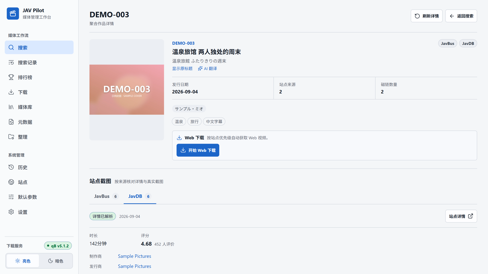
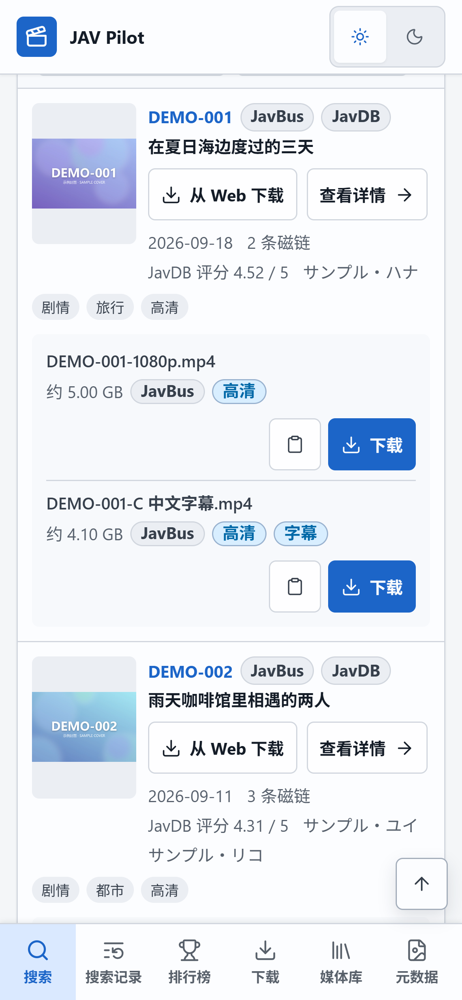

# 使用指南

[返回 README](../README.md)

## 1. 检查站点能否访问

打开“站点”，在“站点诊断”中各填一个确定存在的 JAV 番号和 FC2 番号，点击“测试全部站点”。每个站点按配置、DNS、连接、搜索、详情、图片逐项显示结果：

- 停在 DNS 或连接：网络问题，通常需要设置代理，见[常见问题](faq.md#所有站点都连不上)。
- 停在搜索或详情：站点可能改版、要求人机验证或暂时不可用，可以先在同一页面停用它。

填写的番号会被记住，后台定期用它们复查站点状态。默认启用 JavBus、JavDB、FC2（资料与磁链）以及 JableTV、SupJav、MissAV（Web 下载）；其他来源可在同一页面启用，各站点的差别见[来源说明](sources.md)。

## 2. 连接 qBittorrent（可选）

与 JAV Pilot 一起部署的 qBittorrent 按[安装指南](getting-started.md#同时部署-qbittorrent)设置即可。连接已有的 qBittorrent 时，在“设置 → qBittorrent”中填写：

- **Web API 地址**：qBittorrent 与 JAV Pilot 在同一台主机时填 `http://host.docker.internal:<WebUI 端口>`。不要填 `localhost`，在容器里它指向 JAV Pilot 自己。
- **账号、密码**：qBittorrent WebUI 的登录信息。
- **JAV 下载分类**：新任务都放进这个分类（默认 `jav`），自动整理也只处理这个分类。
- **JAV 下载暂存目录、完成整理目录**：填 **qBittorrent 看到的路径**，不是宿主机路径。完成整理目录留空时不自动移动。

同一个宿主机目录必须同时挂载给 qBittorrent 和 JAV Pilot。例如 qBittorrent 容器把宿主机的 `/volume1/downloads` 挂载为 `/downloads`、`/volume1/media` 挂载为 `/media`：

| 用途 | 宿主机目录 | “设置”中填写 | `.env` 中填写 |
| --- | --- | --- | --- |
| 下载暂存 | `/volume1/downloads/jav` | 暂存目录 `/downloads/jav` | `JAV_PILOT_QB_STAGING_HOST_PATH=/volume1/downloads/jav` |
| 媒体库 | `/volume1/media/JAV` | 整理目录 `/media/JAV` | `JAV_PILOT_LIBRARY_HOST_PATH=/volume1/media/JAV` |

qBittorrent 直接安装在宿主机上时，“设置”中填写的就是宿主机目录本身；“应用内媒体库挂载”保持 `/media/JAV`。修改 `.env` 后执行 `docker compose up -d` 生效。

## 3. 搜索并下载

1. 在“搜索”中输入番号或关键词。输入完整番号可以直接定位作品；打开“精确匹配”只保留番号前缀完全一致的结果。“解析磁链”会逐个打开作品详情获取磁链，关闭后搜索更快，磁链留到详情页再加载。
2. 点击封面或标题打开详情，核对资料和各站截图后选择下载方式：
   - 磁链右侧的“下载”：加入 qBittorrent。
   - “开始 Web 下载”：从视频站下载，默认选择 4K 以内的最高画质，版本按原片、中文字幕、无码的顺序挑选。
3. 在“下载”页查看进度。完成后影片进入媒体库，NFO 和图片自动生成；缺失的可以在“媒体库”一键补全。

搜索页切换到“Web 视频资源”可以按番号前缀批量查找视频站上的作品，勾选后一次提交下载，也可以保存成批量规则反复使用。

手机上打开同一个地址即可，布局会自动适配：

## 4. 调整默认值（可选）

“默认参数”集中设置默认搜索站点、结果数量、Web 下载的画质上限和版本顺序、元数据自动补全、翻译和 AI 翻译。各页面还会记住你在这台设备上最近一次使用的条件。
